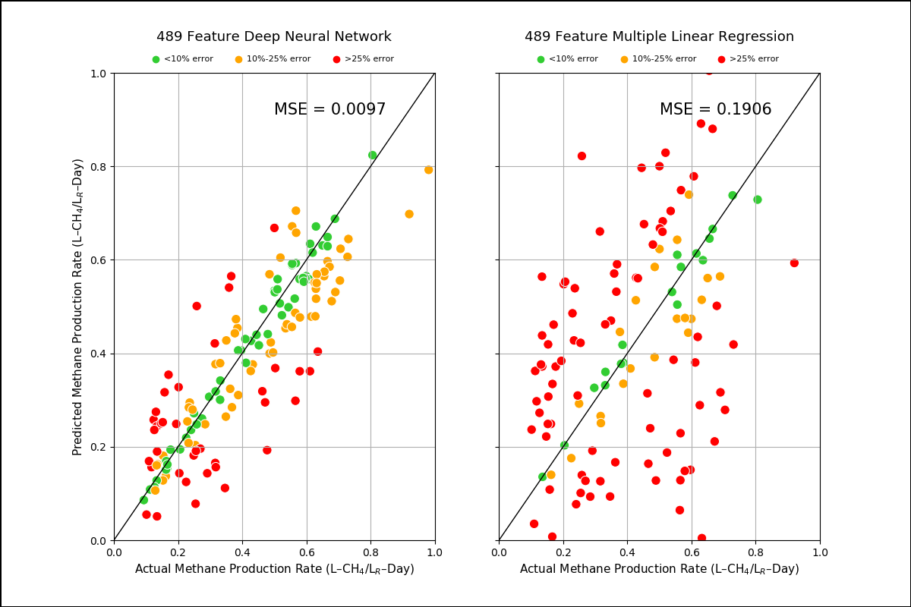

# Predicting anaerobic digester methane production rate with the microbial community composition using deep neural network modeling techniques.

A one-dimensional convolutional neural network (CNN) is trained with raw count data from a microbial community composition dataset to predict the methane production rate of a given sample. The dataset contains data on 489 microbes (features) across 149 sites (samples). Layer-wise relevance propagation (LRP) was used to identify the microbes that are important for the model’s prediction by running a backward pass in the neural network. A mean relevance score can be calculated for each microbe, allowing them to be ranked. Feature reduction techniques using the mean relevance score have proved to produce performance improvements in the model; however, collecting additional data samples could result in a significant improvement of the CNN’s predictive power and reduce the need for feature reduction. Results are compared to a multiple linear regression (MLR) model.

# Demo
The model demo is available in the demo directory. Running the demo will run a cross validation of the input data with both the CNN and MLR model, where feature reduction uses LRP for the CNN and F-tests for MLR. To run the model demo with default parameters: `python demo.py`. The demo defaults to a leave-one-out cross validation using all features.

Specify the number of folds and number of features for cross validation as integers: `python demo.py --num_folds NUM_FOLDS --num_features NUM_FEATURES`

Specify the path for the feature and ground truth csv data files as strings: `python demo.py --X_path X_PATH --y_path Y_PATH`

Specify the output mode of demo as a boolean: `python demo.py --file_output FILE_OUTPUT`

Due to the stochastic nature of neural networks, the results of the demo will vary. The results of a sample run are shown below:

# Credits
Author: Thomas Florian @thomasflorian @ [Ye's MLIP Lab]
